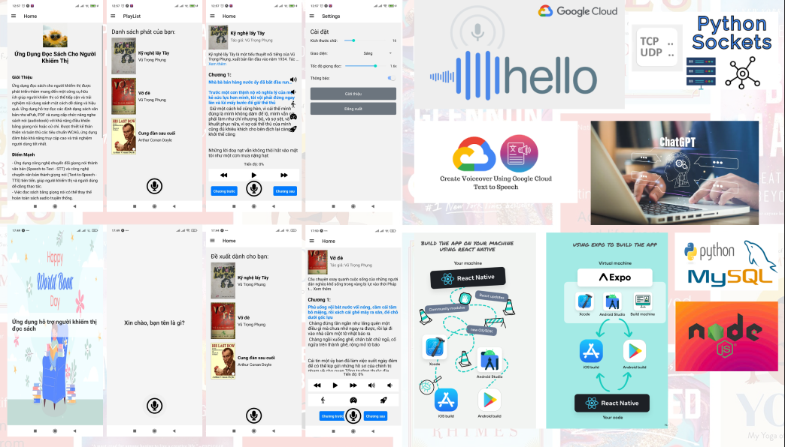

### Item Name (Max: 55 Characters)
Read2me

### Item Short Description (Max: 130)
Smart reading app for everyone: Hear your books come to life with personalized features, voice activation & AI-powered text-to-sp

### Item Tags Keywords (In lower case & separated by commas)
reading app, visually impaired, accessibility, text-to-speech, audiobook, voice activation, ai-powered, personalization, text-to-speech, voice-control

### Item Description
Hear your books come to life with Read2me!
Read2me is a smart reading app designed for everyone, especially those with visual impairments. Our app uses advanced text-to-speech technology and AI-powered features to create a personalized and accessible reading experience.

#### Key Features:

Text-to-Speech: Turn any text into an audiobook with high-quality, natural-sounding voices.

Voice Activation: Control the app hands-free with simple voice commands.

Personalized Reading: Customize reading speed, voice, and other settings to suit your preferences.

AI-Powered Features: Get book summaries, translations, and other helpful tools.

Accessible Design: Built with accessibility in mind, ensuring a seamless experience for all users.

#### Benefits:

Enjoy reading without straining your eyes: Listen to your favorite books while commuting, exercising, or relaxing.

Stay informed and entertained: Access a vast library of books, articles, and other content.

Learn new things: Discover new ideas and perspectives through audiobooks and podcasts.

Connect with others: Share your favorite books and discuss them with friends and family.

Read2me is more than just a reading app. It's your personal reading assistant, making reading accessible and enjoyable for everyone. Download Read2me today and start exploring the world of books in a whole new way!

### Item Demo Link
https://drive.google.com/file/d/1am9Zrv7_ulDf5kq5xgEcT5KZ31JtdmMO/view?usp=sharing
